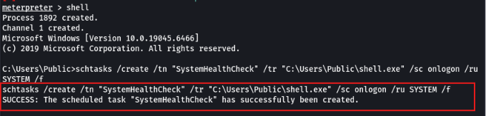
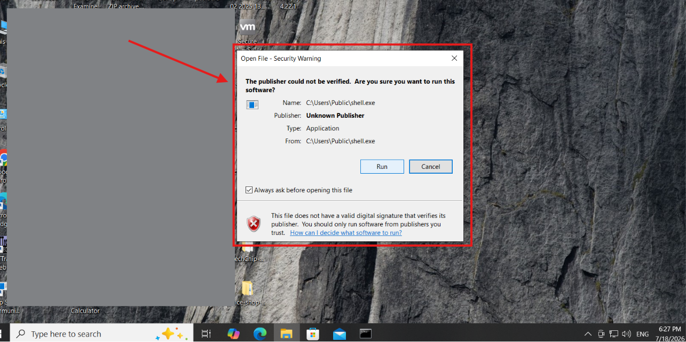
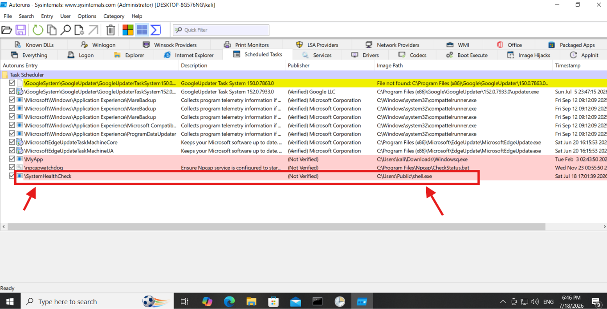
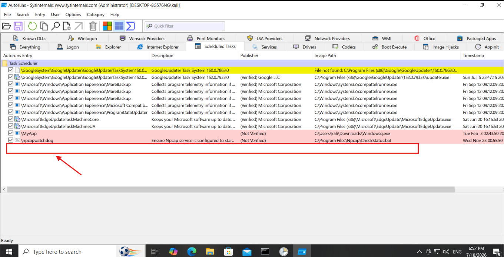

# 🛡️ Lab 02: Persistence Analysis and Forensic Detection

## 📋 Project Summary
This lab focuses on the implementation of **System-Level Persistence** and the subsequent **Forensic Identification** of persistent threats. By simulating an adversary behavior, I demonstrate how to establish persistence through Windows Scheduled Tasks and how to effectively hunt for such indicators using Sysinternals tools.

## 🎯 Objectives
*   **Persistence Engineering:** Utilize `schtasks` to establish a resilient, SYSTEM-level backdoor that survives system reboots.
*   **Threat Hunting:** Perform forensic analysis to detect unauthorized persistence mechanisms.
*   **Remediation:** Execute manual cleanup of system artifacts, including task deletion and registry modification, to restore environment integrity.

---

## 🛠️ Execution Lifecycle

### Phase 1: Persistence Engineering
To ensure long-term access, I established persistence by creating a scheduled task that triggers at every system logon. This mimics the behavior of modern fileless and persistent malware (MITRE ATT&CK [T1053.005](https://attack.mitre.org/techniques/T1053/005/)).

> 
> *Figure 1: Executing SYSTEM-level persistence via CMD.*

> 
> *Figure 2: Execution validation upon system reboot; flagged by the OS security layer.*

### Phase 2: Forensic Hunting
Using **Sysinternals Autoruns**, I performed a deep-dive audit of the system’s startup entries. I specifically looked for "Not Verified" publisher entries, a common Indicator of Compromise (IoC).

> 
> *Figure 3: Identification of the unauthorized `SystemHealthCheck` task via forensic analysis.*

### Phase 3: Remediation & Hardening
Post-detection, I initiated a manual cleanup process. This involved deleting the task, scrubbing the Windows Registry (`HKCU\...\Run`), and purging residual startup artifacts.

> 
> *Figure 4: Final verification confirming the removal of all persistent artifacts.*

---

## 💡 Technical Insights
*   **Layered Persistence:** Persistence is rarely limited to one location. As observed, remediation requires auditing both the Task Scheduler and the Windows Registry (`Run` keys).
*   **Detection Strategy:** The "Not Verified" status of a binary in an administrative folder is a high-fidelity alert for threat hunters.
*   **System Integrity:** Professional remediation involves a recursive audit of the system to ensure no "ghost entries" remain.

---

## 🚀 Future Scope
This lab sets the foundation for Phase 3, where I will pivot to **Memory Forensics** and **x64 Assembly Analysis** to understand how threats operate at the process-memory level.
